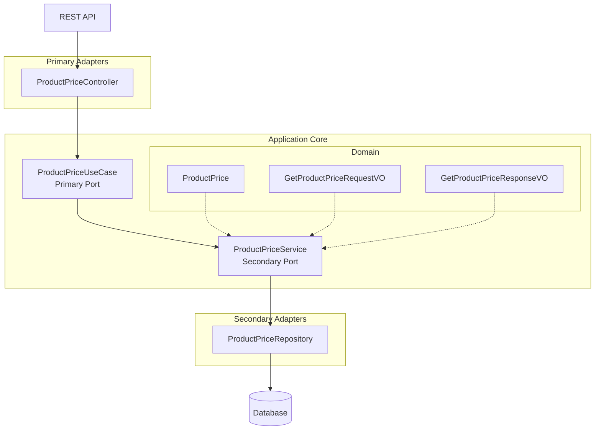
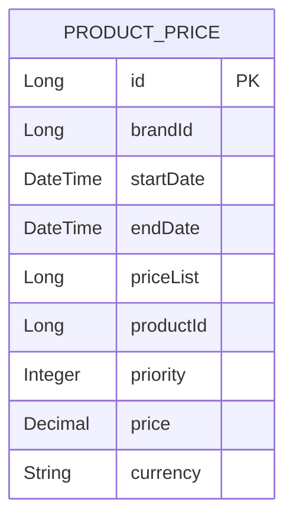

# BCNB Products API

A Spring Boot application that manages product prices with time-based price variations and priority rules.

## Table of Contents
- [Overview](#overview)
- [Architecture](#architecture)
- [Technical Stack](#technical-stack)
- [API Documentation](#api-documentation)
- [Getting Started](#getting-started)
- [Testing](#testing)

## Overview

This service provides REST APIs to manage product prices across different time periods.

### Key Features
- Get product prices for specific timestamps
- Priority-based price selection
- Currency support

## Architecture

### Hexagonal Architecture


### Database Schema


## Technical Stack

- **Framework:** Spring Boot
- **Language:** Java
- **Database:** JPA/Hibernate
- **Documentation:** OpenAPI/Swagger
- **Build Tool:** Gradle
- **Testing:** JUnit, Spring Test

## API Documentation

### Endpoints

#### Get Product Price
```
GET /api/v1/products/prices/apply-time
```

Query Parameters:
- `productId` (required): Product identifier
- `brandId` (required): Brand identifier
- `applicationTime` (required): ISO DateTime for price application

Example Request:
```
GET /api/v1/products/prices/apply-time?productId=35455&brandId=1&applicationTime=2020-06-14T12:00:00.000Z
```

Success Response (200 OK):
```json
{
    "productId": "35455",
    "brandId": "1",
    "applicationTime": "2020-06-14T12:00:00.000Z",
    "priceList": "1",
    "price": 35.50,
    "currency": "EUR"
}
```

## Getting Started

### Prerequisites
- Java 21 or higher
- Gradle

### Installation

1. Clone the repository
```bash
git clone https://github.com/brianstremel/bcnb-products
```

2. Navigate to project directory
```bash
cd bcnb-products
```

3. Build the project
```bash
./gradlew build
```

4. Run the application
```bash
./gradlew bootRun
```


## Testing

The project includes comprehensive test coverage including:
- Unit tests
- Integration tests
- API tests

Run tests using:
```bash
./gradlew test
```
